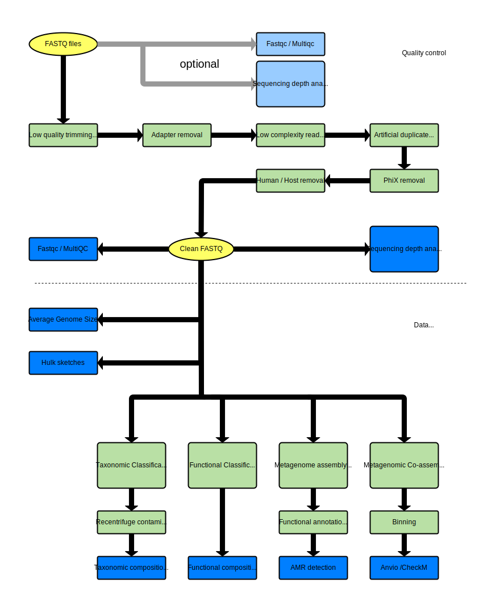

# Disclaimer
This is pre-publication software that is currently under active development. Use it at your own risk. Bug reports are welcome, but a user cannot depend on getting support at this time.

# Talos
A shotgun metagenomic analysis pipeline using nextflow. This pipeline is developed as part of the bioinformatic toolkit for metagenomic data analysis at the Norwegian veterinary institute as part of the Internal SEQ-TECH project.
Author: Thomas H.A. Haverkamp, [@Thomieh](https://twitter.com/Thomieh)

Contact information: please submit an issue, and the author will get back to you.

# Licence
This software is published under the BSD 3-clause license. See the LICENSE file in the repository.

# How to use
The Wiki contains information about how to install and run.

# Workflow scheme

